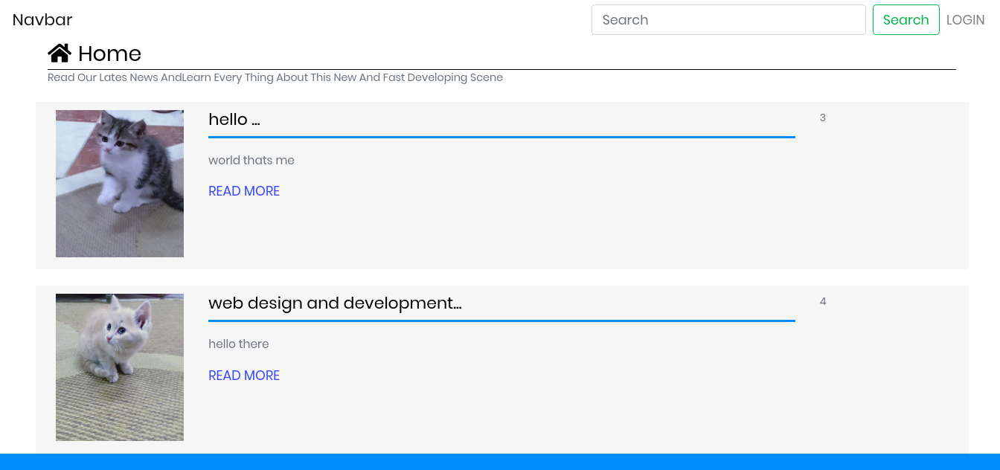
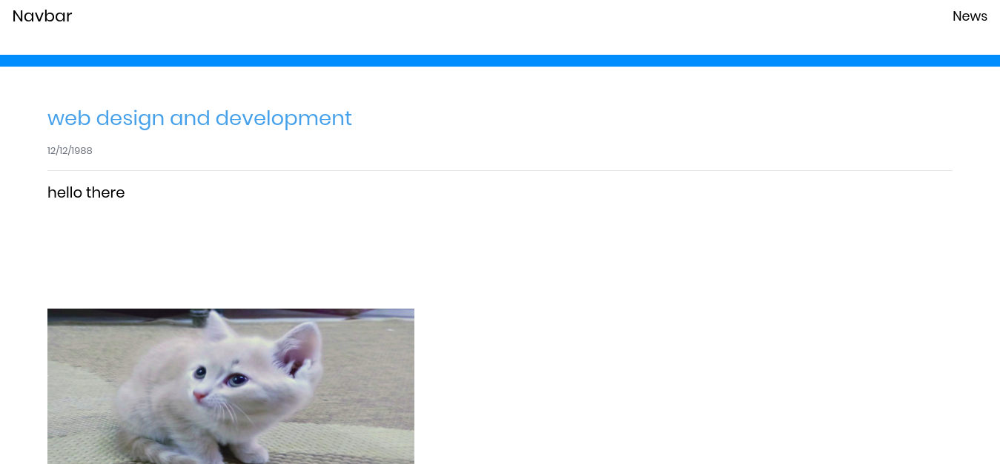

# native_project_php_addArticles
it's a native php project without using frameworks. it has an login system and admin can add articles.

# installation:

1- download php on your machine from here "https://www.apachefriends.org/download.html"

2- make a database called "firstpage" or alternatively config your database in file connection.php:

$con = mysqli_connect('localhost' , 'username for database',' password for database' , 'name of your database');

3- this project doesnot have register system so you must add tables called "admins":

